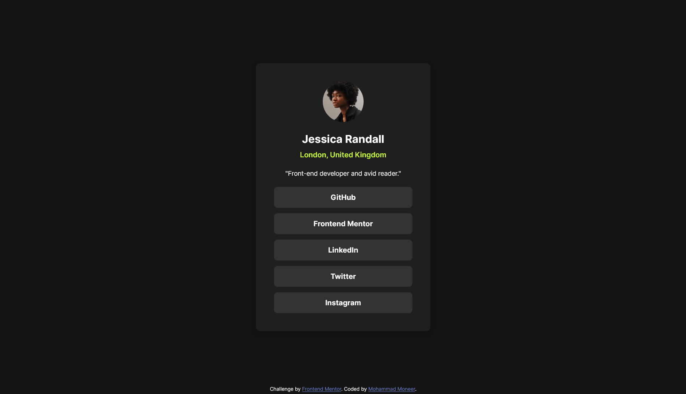
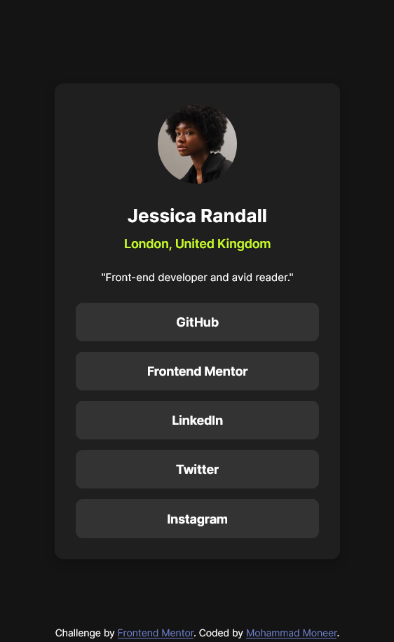

# Frontend Mentor - Social Links Profile solution

This is a solution to the [Social Links Profile Challenge on Frontend Mentor](https://www.frontendmentor.io/challenges/social-links-profile-UG32l9m6dQ). Frontend Mentor challenges help you improve your coding skills by building realistic projects. 

## Table of contents

- [Overview](#overview)
  - [Screenshot](#screenshot)
  - [Links](#links)
- [My process](#my-process)
  - [Built with](#built-with)
  - [What I learned](#what-i-learned)
- [Author](#author)

## Overview
To get some details and background of this project visit the link below:
[Frontend Mentor | Social Links Profile coding challenge](https://www.frontendmentor.io/challenges/social-links-profile-UG32l9m6dQ)

### Screenshot

Desktop version

Mobile version

### Links

- [GitHub Repository](https://github.com/Mohammad-Moneer/Social-Links-Profile)
- [Live Demo](https://mohammad-moneer.github.io/Social-Links-Profile/)

## My process

### Built with

- HTML
- CSS
- Flexbox

### What I learned

- Centering element within the whole body
- Border radius
- CSS Variables
- Media query
- Link states
- Making transition effects on link hover

## Author

- Frontend Mentor - [@Mohammad-Moneer](https://www.frontendmentor.io/profile/Mohammad-Moneer)